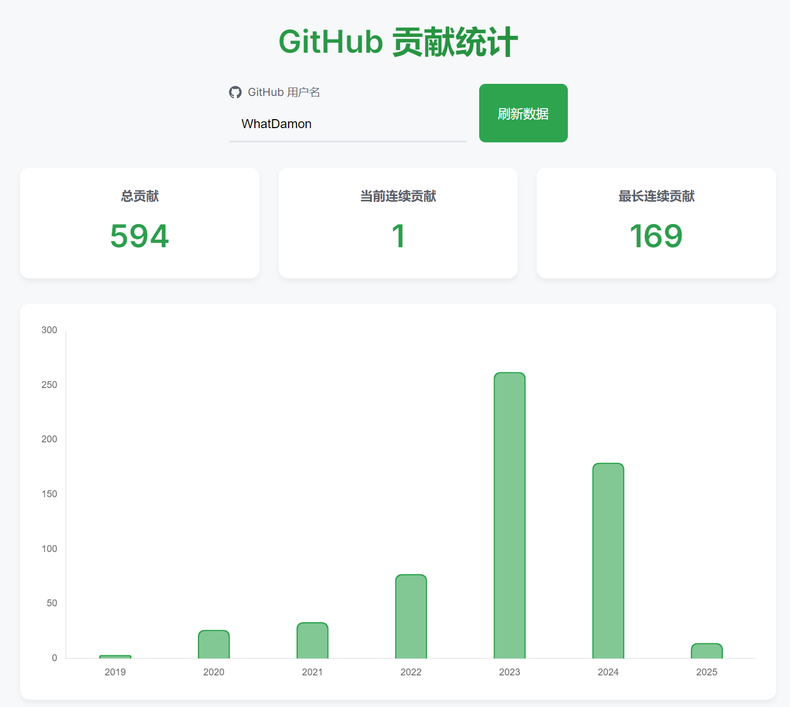
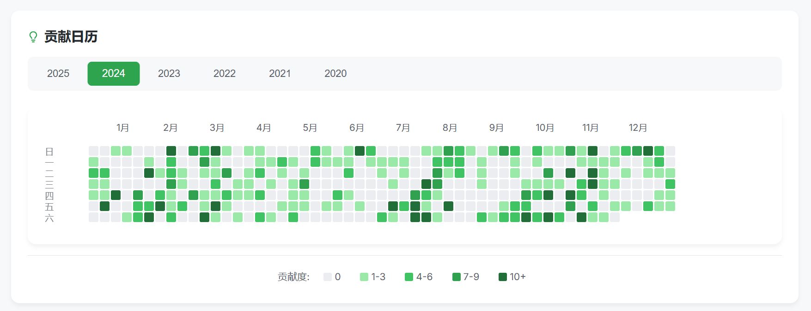

# GitHub 贡献统计

一个优雅的 GitHub 贡献数据可视化工具，展示用户的贡献热力图、年度统计和连续贡献等数据。





**🌐 体验最新Commit：https://iicsc.damon233.top/github-contributions**

## ✨ 特性

- 📊 贡献热力图展示
- 📈 年度贡献统计图表
- 🔥 连续贡献天数统计
- 🎯 总贡献数据统计
- 💫 流畅的动画效果
- 🌓 简洁现代的界面设计

## 🚀 快速开始

1. 克隆仓库：
```bash
git clone https://github.com/IICSC/github-contributions.git
cd github-contributions
```

2. 使用 HTTP 服务器运行项目（例如使用 Python）：
```bash
# Python 3
python -m http.server 8000

# Python 2
python -m SimpleHTTPServer 8000
```

_**注：**`8000` **为端口，可以修改**_

3. 在浏览器中访问：`http://localhost:8000`

_**注：您也可以直接打开** `index.html`_

## 🛠️ 项目结构

```
github-contributions/
 ├── fonts/
 │    └── Hubot-Sans.woff2       # 自定义字体
 │
 ├── images/
 │    └── placeholder-avatar.svg # 头像占位
 │
 ├── index.html                  # 主页面HTML结构
 │    ├── 导航栏
 │    ├── 用户输入区
 │    ├── 统计卡片
 │    ├── 图表区域
 │    └── 页脚
 │
 ├── styles.css                  # 样式文件
 │    ├── 主题变量
 │    ├── 布局样式
 │    ├── 组件样式
 │    └── 动画效果
 │
 ├── yearly_contributions.js     # 年度统计相关
 │    ├── 数据处理
 │    ├── 图表生成
 │    ├── 动画效果
 │    └── 事件处理
 │
 ├── heatmap.js                  # 贡献热力图相关
 │    ├── 热力图生成
 │    ├── 日期处理
 │    ├── 动画效果
 │    └── 交互处理
 │
 └── monthly_activity.js         # 月度活动统计
      ├── 数据处理
      └── 图表生成
```

### 核心文件说明

#### 📄 index.html
- 定义页面结构和布局
- 引入所需的样式和脚本
- 包含主要的HTML组件

#### 📄 styles.css
- 定义自定义WOFF字体
- 定义全局主题变量
- 设置响应式布局
- 实现组件样式
- 定义动画效果

#### 📄 yearly_contributions.js
- 处理年度贡献数据
- 生成年度统计图表
- 计算连续贡献天数
- 处理数据刷新逻辑

#### 📄 heatmap.js
- 生成贡献热力图
- 处理日期和贡献数据
- 实现交互效果
- 管理动画效果

#### 📄 monthly_activity.js
- 处理月度活动数据
- 生成月度统计图表

### 修改指南

1. 修改主题样式
   - 在 `styles.css` 中更改主题变量
   - 调整组件样式和动画效果

2. 更新页面结构
   - 在 `index.html` 中修改HTML结构
   - 添加或移除组件

3. 调整数据处理
   - 在对应的 JS 文件中修改数据处理逻辑
   - 更新图表配置和动画效果

4. 添加新功能
   - 创建新的 JS 文件
   - 在 `index.html` 中引入
   - 添加相应的样式和交互 

## ⚖️ 许可证

本项目使用 [MIT 许可证](https://github.com/IICSC/github-contributions/blob/main/LICENSE) 开源

### 使用到的开源项目及资源

- [Chart.js](https://github.com/chartjs/Chart.js)（MIT 许可证）
- [Hubot Sans](https://github.com/github/hubot-sans)（OFL-1.1 许可证）
